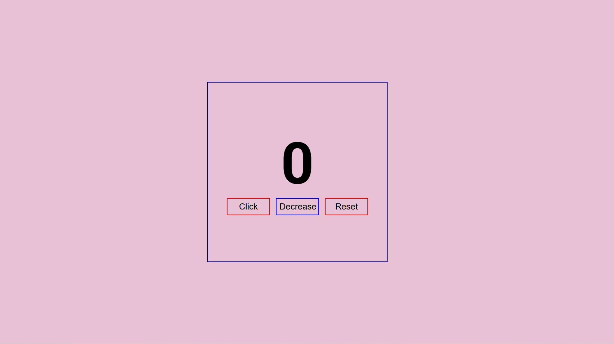

# ⏱ Contador Simple

✨ Bienvenido/a a este proyecto de **Contador Simple** realizado con **HTML**, **CSS** y **JavaScript**. Este contador es una herramienta sencilla que permite incrementar, disminuir y resetear un número con solo presionar algunos botones. Ideal para practicar fundamentos de programación web. 

---

## 🔧 Tecnologías Utilizadas

- **HTML**: Estructura del proyecto.
- **CSS**: Estilo y diseño visual.
- **JavaScript**: Lógica y funcionalidades interactivas.

---

## 📊 Características

- ➕ Incrementar el contador.
- ➖ Disminuir el contador.
- ⏪ Restablecer el contador a 0.
- Interfaz minimalista y fácil de usar.

---

## 🎨 Vista Previa

---

## 👋 Autor/a

Desarrollado con mucho ❤️ por Alan Chala.

---

¡Gracias por visitar este proyecto! 🎉