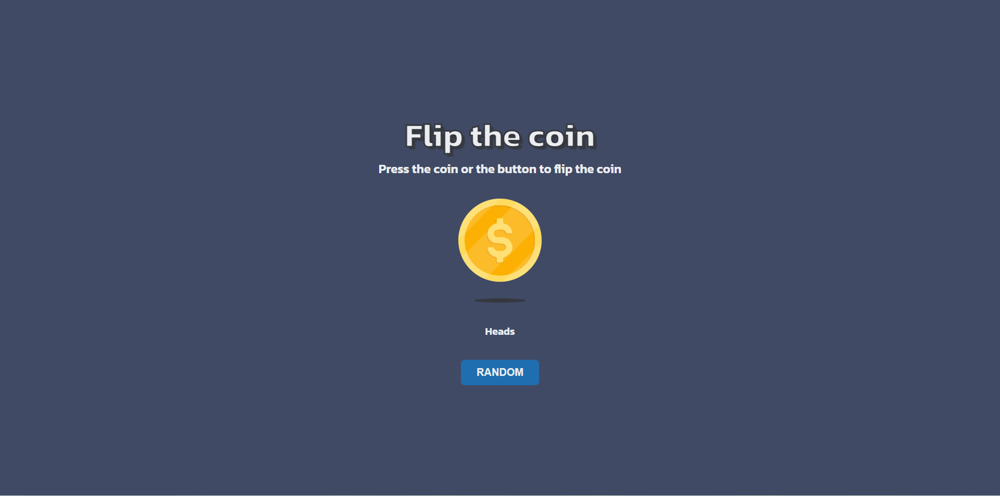

# Gira la moneda

---

## Tecnologías Utilizadas

- **HTML**: Para estructurar el contenido de la página.
- **CSS**: Para estilizar la interfaz del usuario.
- **JavaScript**: Para la funcionalidad de generación de citas.

---

## Preview

---

¡Gracias por visitar este proyecto! 🎉