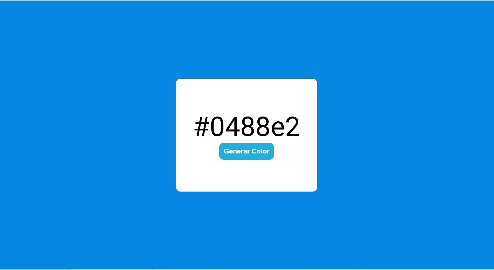

# Generador de Color HEX Aleatorio 😍

Este proyecto es una aplicación web simple que genera un color hexadecimal aleatorio cada vez que el usuario hace clic en un botón. Está diseñado utilizando **HTML**, **CSS** y **JavaScript**.

## Características

- Genera colores HEX aleatorios con un solo clic.
- Muestra el color generado en pantalla, aplicándolo como fondo.
- Muestra el código del color para que el usuario pueda copiarlo fácilmente.

## Tecnologías Utilizadas

- **HTML**: Para estructurar el contenido de la página.
- **CSS**: Para estilizar la interfaz del usuario.
- **JavaScript**: Para la funcionalidad de generación de colores.

## Capturas de Pantalla

## Cómo Funciona

1. **Generación del color**: El script utiliza JavaScript para generar un código de color HEX aleatorio usando combinaciones aleatorias de valores RGB en formato hexadecimal.
2. **Aplicación del color**: El color generado se aplica dinámicamente como fondo de la página y se muestra su código HEX.

## Mejoras Futuras

- Agregar un botón para copiar automáticamente el código HEX al portapapeles.
- Implementar un historial de colores generados.
- Posibilidad de elegir entre diferentes formatos de color (RGB, HSL, etc.).