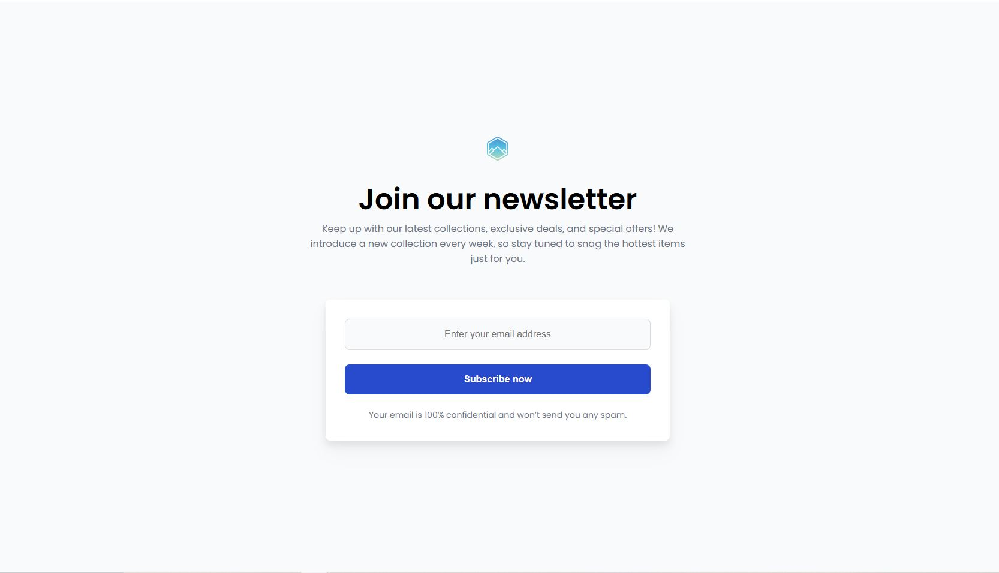

# ✉️ Formulario de Suscripción a Newsletter

✨ Bienvenido/a a este proyecto de **Formulario de Suscripción** creado con **HTML** y **CSS**. Este formulario permite a los usuarios suscribirse fácilmente a una lista de correos para mantenerse actualizados con las últimas colecciones, ofertas exclusivas y novedades.

---

## 🔧 Tecnologías Utilizadas

- **HTML**: Proporciona la estructura del sitio, incluyendo el formulario de entrada y el botón de suscripción.
- **CSS**: Define el estilo y diseño visual para una experiencia de usuario atractiva y moderna.

---

## 📊 Características

- 📩 Campo para ingresar la dirección de correo electrónico.
- 🔵 Botón de suscripción con diseño llamativo.
- 🔒 Mensaje de privacidad asegurando que el correo no será utilizado para spam.
- Diseño minimalista y amigable.

---

## 🎨 Vista Previa

---

## 👋 Autor/a

Desarrollado con 💙 para demostrar una interfaz sencilla y funcional.

---

¡Gracias por revisar este proyecto! 🌟