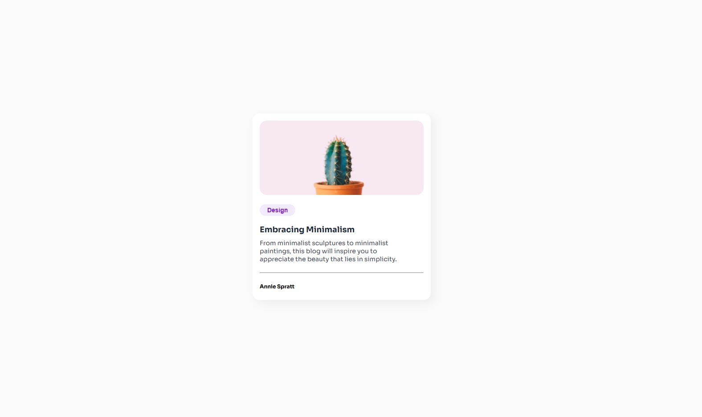

# 📝 Blog Card Simple

✨ Bienvenido/a a este proyecto de **Blog Card Simple** creado con **HTML** y **CSS**. Esta tarjeta es ideal para mostrar artículos, publicaciones o cualquier contenido en un diseño moderno y minimalista. Es una excelente opción para practicar los fundamentos de programación web.  

---

## 🔧 Tecnologías Utilizadas

- **HTML**: Para la estructura y contenido de la tarjeta.  
- **CSS**: Para el diseño visual y estilos modernos.  

---

## 📊 Características

- 📄 Espacio para el título, descripción breve y una imagen destacada.  
- 🌟 Diseño limpio y adaptable (responsive).  
- 🎨 Fácil personalización para diferentes temáticas o estilos.  
- 💬 Opcional: Botón de "Leer más" o enlaces a artículos.  

---

## 🎨 Vista Previa  

---

## 👋 Autor/a  

Desarrollado con dedicación y estilo por Alan Chala.  

---

¡Gracias por revisar este proyecto! 🎉
