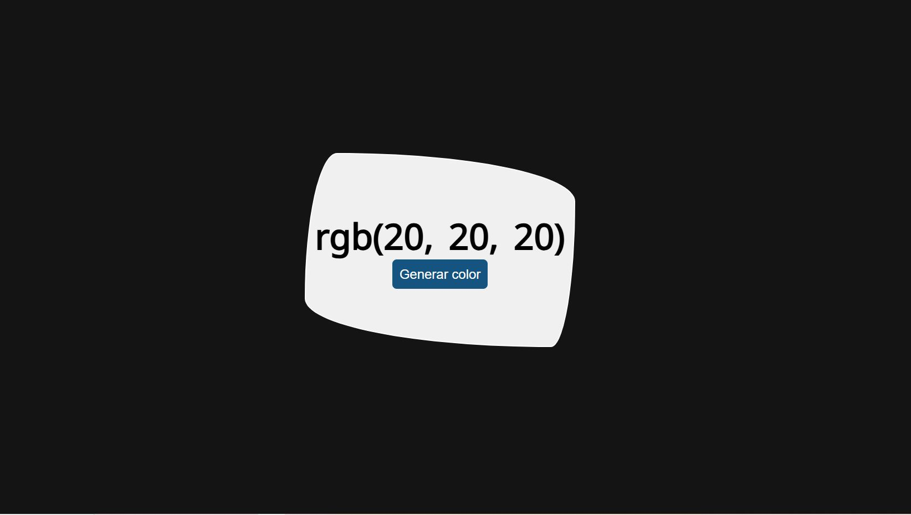

# Generador de Colores RGB Aleatorio

## Descripción
Este proyecto es una aplicación simple que genera colores aleatorios en formato RGB con un clic. Está desarrollado utilizando HTML, CSS y JavaScript. Al interactuar con el botón de la aplicación, el fondo de la pantalla cambia al color generado, y el código RGB se muestra en pantalla.

---

## Características
- Generación aleatoria de colores RGB.
- Cambio dinámico del color de fondo.
- Visualización del valor RGB en pantalla.

---

## Tecnologías Utilizadas
- **HTML**: Estructura del proyecto.
- **CSS**: Estilo visual del generador.
- **JavaScript**: Lógica para generar los colores aleatorios y manejar los eventos.

---

## Preview
