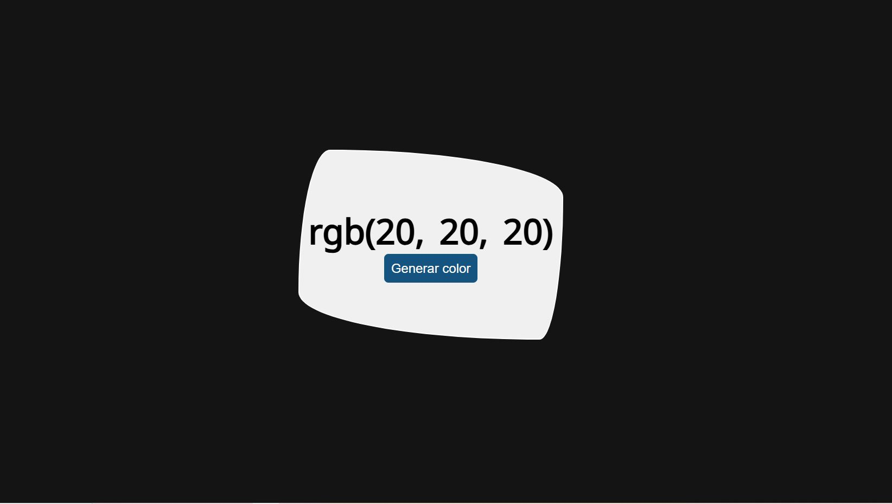

# Generador de Colores RGB Aleatorio

---

## 🔧 Tecnologías Utilizadas

- **HTML**: Estructura del proyecto.
- **CSS**: Estilo y diseño visual.
- **JavaScript**: Lógica y funcionalidades interactivas.

---

## Preview

---

¡Gracias por visitar este proyecto! 🎉