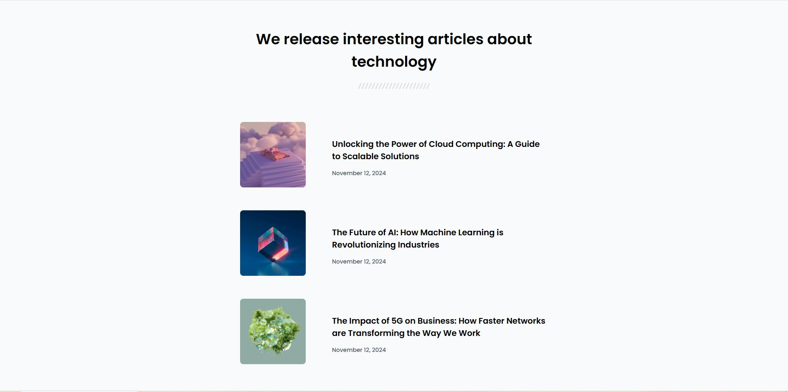

# 📰 Simple Article Listing

✨ **Listado de Artículos Simple** creado con **HTML** y **CSS**. Este diseño básico y funcional es ideal para mostrar una lista de artículos organizados por secciones, manteniendo una interfaz limpia y fácil de usar.  

---

## 🔧 Tecnologías Utilizadas  

- **HTML**: Para la estructura de la página.  
- **CSS**: Para el diseño visual y la experiencia de usuario.  

---

## 📊 Características  

- 🖼 Diseño limpio y estructurado.  
- 📱 Diseño adaptable (responsive) para todos los dispositivos.  
- 🎨 Fácil de personalizar según tus necesidades.  
- 🚀 Ideal para pequeñas presentaciones o prototipos.  

---

## 🎨 Vista Previa  

---

## 👋 Autor/a  

Desarrollado con pasión por Alan Chala.  

---

¡Gracias por visitar este proyecto! 🎉