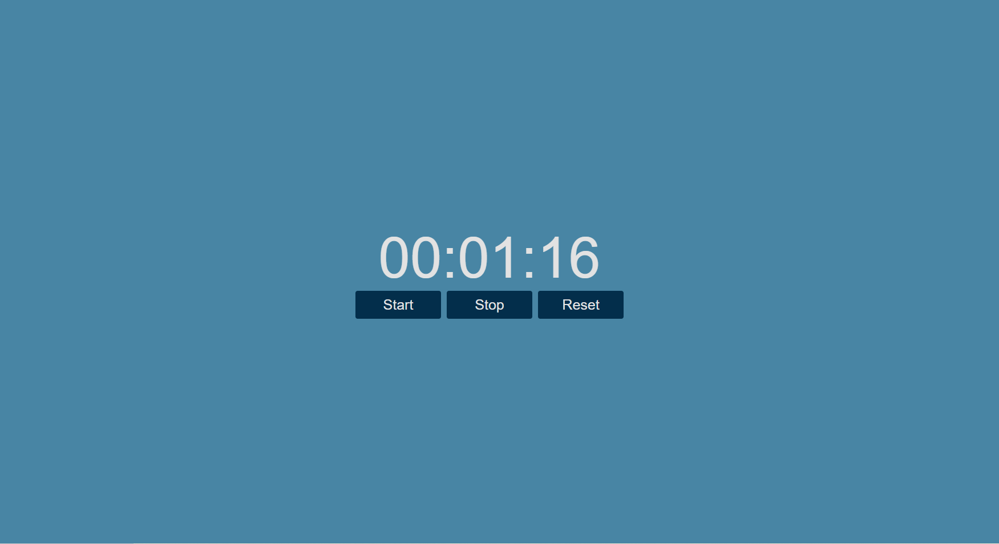

# Cronometro

---

## 🔧 Tecnologías Utilizadas

- **HTML**: Para la estructura y contenido.  
- **CSS**: Para el diseño visual y estilos modernos.  
- **JS**: Agrega interactividad

---

## 🎨 Vista Previa  

---

¡Gracias por visitar este proyecto! 🎉